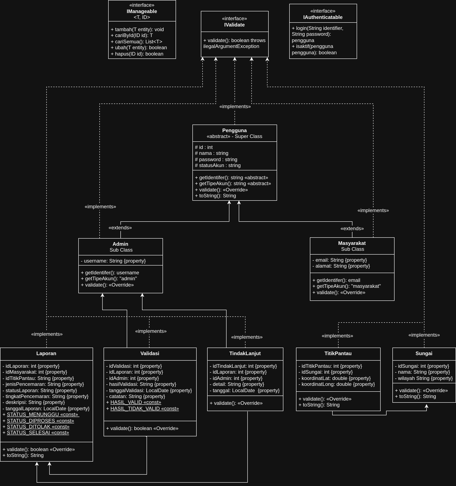

# 🌊 Riverr - Sistem Pelaporan Pencemaran Sungai

Aplikasi manajemen dan pelaporan pencemaran sungai berbasis *Object-Oriented Programming* (OOP) menggunakan *Java Swing* untuk antarmuka pengguna dan penyimpanan data *Java Collections Framework* di dalam memori (*in-memory*).

---

## 📋 Deskripsi Aplikasi
**Riverr** adalah sistem pelaporan pencemaran sungai berbasis Java Swing. Masyarakat dapat melaporkan kejadian pencemaran, sedangkan Admin memvalidasi serta menindaklanjuti setiap laporan yang masuk.

### 🔄 Alur Sistem
1. **Masyarakat:** Daftar ➔ Login ➔ Buat Laporan
2. **Admin:** Validasi Laporan ➔ Tindak Lanjut *(Jika Valid)* ➔ Laporan **SELESAI**

---

## 👥 Profil & Pembagian Peran Kelompok (Kelompok 7)

Berikut adalah rincian kontribusi, tanggung jawab, dan bukti pengerjaan objektif dari setiap anggota tim pengembang:

| NIM & Nama | Peran Utama | Rincian Tugas & Fokus | Bukti Objektif di Git |
| :--- | :--- | :--- | :--- |
| **254311027**<br>Bangkit Cahya Linuwih | 🏗️ Role 1: Class Architect<br>*(Fokus: Struktur OOP)* | • Membuat Class Diagram di draw.io.<br>• Mendefinisikan *Superclass*, *Subclass*, *Interface* (`IManageable`, `IAuthenticatable`), dan *Abstract Class*.<br>• Memastikan implementasi *Encapsulation* (Getter/Setter) diterapkan dengan benar pada model. | Pembuat file model / entitas utama.<br>*(Contoh: Pengguna.java, Laporan.java, Masyarakat.java, Admin.java)* |
| **254311007**<br>SILFINA NUR FADILAH | ⚙️ Role 2: Data & Logic Engineer<br>*(Fokus: Collections & CRUD)* | • Mengimplementasikan *ArrayList* atau *List* sebagai media penyimpanan data laporan dan pengguna di memori.<br>• Membuat fungsi logika *Create, Read, Update, Delete* (CRUD) untuk memanipulasi objek pelaporan. | Pembuat file Controller atau Service.<br>*(Contoh: PelaporanService.java, MasyarakatService.java)* |
| **254311015**<br>ABDUL AZIZ MUSHTHOFA | 🛡️ Role 3: UI & Robustness Engineer<br>*(Fokus: Debugging & Form)* | • Merancang menu interaksi aplikasi menggunakan komponen grafis GUI (*Java Swing*).<br>• Mengimplementasikan blok *try-catch* pada setiap input user di komponen View.<br>• Melakukan validasi data input agar aplikasi tidak mudah *crash*. | Pembuat file View / GUI Panel dan penanggung jawab blok *Exception Handling* (MainFrame.java, Panel files). |
| **254311001**<br>AISYAH NUR FADILLAH | 🧪 Role 4: Quality Assurance & Repo Master<br>*(Fokus: Testing & Git)* | • Mengelola *merging branch* ke develop di Git dan menyelesaikan jika terjadi *code conflict*.<br>• Menulis skenario pengujian menggunakan *Unit Testing* (JUnit).<br>• Menyusun dokumentasi teknis dan konfigurasi akhir README.md. | Pembuat file Test *(Contoh: PelaporanTest.java)*, grafik aktivitas *merge* di GitHub, dan penulis utama README.md. |

---

## 📊 Class Diagram & Arsitektur

Berikut adalah rancangan struktur kelas aplikasi Riverr yang didesain menggunakan draw.io:



----

## 🏛️ Arsitektur & Konsep OOP Sistem

### 1. Hubungan Kelas (Inheritance & Abstract Class)
* **Superclass:** `Pengguna` (Bersifat *abstract*, tidak dapat di-instansiasi langsung).
* **Subclass:** 
  * `Admin` (Login menggunakan *username*).
  * `Masyarakat` (Login menggunakan *email*).
* **Pewarisan Atribut:** Kelas `Admin` dan `Masyarakat` mewarisi seluruh *fields* utama dari `Pengguna`, yaitu: `id`, `nama`, `password`, dan `statusAkun`.

---

### 2. Kontrak Sistem (Interfaces)

Aplikasi ini menerapkan beberapa *interface* untuk memastikan standarisasi kode:

| Interface | Implementasi | Deskripsi / Kontrak |
| :--- | :--- | :--- |
| **`IManageable<T, ID>`** | Semua kelas *Service* | Kontrak operasi CRUD standar secara generik. |
| **`IAuthenticatable`** | `AdminService` & `MasyarakatService` | Kontrak untuk menangani mekanisme sistem login. |
| **`IValidatable`** | Semua kelas *Model* | Kontrak untuk validasi data mandiri sebelum diproses. |
| **`Refreshable`** | Semua kelas *Panel View* | Kontrak untuk pembaruan data pada UI secara otomatis. |

---

### 3. Enkapsulasi (Encapsulation)
> 🔒 **Prinsip Keamanan Data:** Semua *fields* atau atribut pada kelas model diatur dengan hak akses `private` atau `protected`. Data tersebut tidak dapat diakses secara langsung dari luar kelas, melainkan harus melalui metode **Getter** dan **Setter** yang aman.

---

### 4. Polimorfisme (Polymorphism)
Aplikasi memanfaatkan polimorfisme untuk fleksibilitas objek melalui beberapa metode:
* **`getIdentifier()`**: Mengembalikan *username* pada objek `Admin`, dan *email* pada objek `Masyarakat`.
* **`getTipeAkun()`**: Mengembalikan string `"Admin"` atau `"Masyarakat"` sesuai dengan tipe asli objek yang sedang berjalan.
* **`SessionManager.login(Pengguna p)`**: Menerima argumen bertipe *superclass* `Pengguna`, sehingga mampu menyimpan sesi aktif dari objek subclass apa pun secara dinamis.

---

### 5. Manajemen Memori & Pola Desain (Collections & Singleton)
* **Collections (`ArrayList`)**: Seluruh manajemen data disimpan sementara di dalam memori menggunakan objek `ArrayList<T>` yang dipusatkan pada satu gerbang data (`DataStore`).
* **Singleton Pattern**: Kelas `DataStore` mengadopsi pola *Singleton*. Hal ini menjamin hanya ada **satu instance** media penyimpanan di seluruh siklus hidup aplikasi demi menjaga konsistensi data.

---

### 6. Penanganan Error (Exception Handling)
Alur penanganan kesalahan dibagi menjadi dua peran:
1. **Layer Service:** Bertugas melakukan validasi logika bisnis. Jika ditemukan input yang tidak valid atau melanggar aturan, *service* akan melempar `IllegalArgumentException`.
2. **Layer View:** Semua aksi pengguna di layer ini dibungkus dengan blok `try-catch`. Layer ini bertugas menangkap (*catch*) *exception* dari *service* dan menampilkannya kepada pengguna dalam bentuk pesan error UI yang informatif.


----

### 📁 Struktur Folder Proyek

Berikut adalah hierarki direktori dan organisasi komponen kode pada proyek **riverr-oop**:

```text
riverr-oop/
├── src/
│   ├── Main.java                      ← Entry point utama aplikasi
│   │
│   ├── interfaces/                    ← Kontrak arsitektur sistem
│   │   ├── IManageable.java
│   │   ├── IAuthenticatable.java
│   │   └── IValidatable.java
│   │
│   ├── models/                        ← Kelas cetak biru data (Blueprint)
│   │   ├── Pengguna.java              ← Abstract superclass
│   │   ├── Admin.java                 ← Subclass dari Pengguna
│   │   ├── Masyarakat.java            ← Subclass dari Pengguna
│   │   ├── Laporan.java
│   │   ├── Validasi.java
│   │   ├── TindakLanjut.java
│   │   ├── Sungai.java
│   │   └── TitikPantau.java
│   │
│   ├── services/                      ← Logika bisnis, manajemen memori, & sesi
│   │   ├── DataStore.java             ← Singleton Pattern (Pusat 7 ArrayList)
│   │   ├── SessionManager.java        ← Manajemen sesi aktif (Polimorfisme)
│   │   ├── MasyarakatService.java
│   │   ├── AdminService.java
│   │   ├── LaporanService.java
│   │   ├── ValidasiService.java
│   │   ├── TindakLanjutService.java
│   │   └── SungaiService.java
│   │
│   ├── view/                          ← Layer Antarmuka Pengguna (UI)
│   │   ├── Refreshable.java           ← Kontrak auto-refresh UI
│   │   ├── UIHelper.java              ← Utilitas pembantu komponen UI
│   │   ├── MainFrame.java             ← Jendela utama aplikasi
│   │   ├── LoginPanel.java
│   │   ├── RegisterPanel.java
│   │   ├── DashboardMasyarakatPanel.java
│   │   ├── LaporanPanel.java
│   │   ├── DashboardAdminPanel.java
│   │   ├── ValidasiPanel.java
│   │   └── TindakLanjutPanel.java
│   │
│   └── test/                          ← Layer Pengujian Sistem (Unit Testing)
│       ├── PenggunaModelTest.java     ← Memuat 18 test case
│       ├── LaporanServiceTest.java    ← Memuat 25 test case
│       └── MasyarakatServiceTest.java ← Memuat 17 test case
│
├── docs/                              ← Dokumentasi teknis proyek
│   ├── class-diagram.png              ← Diagram visual arsitektur OOP
│   ├── TAHAP_1_ROLE1_CLASS_ARCHITECT.md
│   ├── TAHAP_2_ROLE2_DATA_ENGINEER.md
│   ├── TAHAP_3_ROLE3_UI_ENGINEER.md
│   └── TAHAP_4_ROLE4_QA_REPO_MASTER.md
│
└── lib/                               ← Library / Dependency eksternal
    └── junit-platform-console-standalone-1.10.x.jar

```
---

### 🔄 Alur Status Laporan

Berikut adalah siklus hidup (*lifecycle*) penanganan status laporan sejak pertama kali dikirimkan oleh pengguna hingga selesai diproses:

```text
  [ Masyarakat buat laporan ]
               │
               ▼
       ┌─[ MENUNGGU ]─┐
       │              │
       │ (Valid)      │ (Tidak Valid)
       ▼              ▼
  [ DIPROSES ]   [ DITOLAK ]
       │
       │ (Tindak Lanjut)
       ▼
  [ SELESAI ]

```
---

### 🛠️ Arsitektur & Teknologi

Proyek ini dibangun menggunakan spesifikasi teknologi dan standardisasi berikut:

| Komponen | Teknologi / Spesifikasi | Peran & Deskripsi |
| :--- | :--- | :--- |
| **Bahasa Pemrograman** | Java (JDK 17 atau lebih baru) | Bahasa utama dengan fitur modern (Record, Pattern Matching, dll). |
| **Antarmuka Grafis** | Java Swing (GUI) | *Framework* bawaan Java untuk membangun *desktop interface* (Layar Utama & Panel). |
| **Paradigma** | Object-Oriented Programming (OOP) | Fondasi utama arsitektur sistem (*Inheritance, Polymorphism, Encapsulation*). |
| **Penyimpanan Data** | Java Collections Framework (`ArrayList`) | Manajemen penyimpanan data terpusat secara sementara di dalam memori (*In-Memory Store*). |
| **Pengujian** | JUnit Testing v5 | *Framework* pengujian otomatis untuk validasi model dan fungsionalitas service. |
| **Version Control** | Git & GitHub | Media kolaborasi tim, pelacakan riwayat kode, dan manajemen repositori. |

---

### 🚀 Cara Menjalankan Aplikasi

#### 🔹 Langkah Menggunakan IDE / Text Editor
1. **Klon repositori ini:**
   ```bash
   git clone [https://github.com/USERNAME/riverr-oop.git](https://github.com/USERNAME/riverr-oop.git)
   
2. Buka proyek melalui IDE pilihan Anda (IntelliJ IDEA, Eclipse, NetBeans, atau VS Code).
3. Atur source root proyek Anda ke direktori folder src/.
4. Jalankan aplikasi dengan klik kanan pada file src/Main.java ➔ Pilih Run 'Main.main()'.

🔹 Langkah Menggunakan Terminal (CLI)
1. Buka terminal atau command prompt, lalu masuk ke direktori src:
   ```Bash
   cd src
2. Kompilasi seluruh file Java yang ada di dalam package:
   ```Bash
   javac -cp . Main.java interfaces/*.java models/*.java services/*.java view/*.java
3. Jalankan main class aplikasi:
   ```Bash
   java Main
### 🔑 Akun Bawaan (Default Accounts)

Aplikasi ini telah menyediakan data akun bawaan di dalam memori (`DataStore`) yang siap digunakan untuk pengujian sistem saat pertama kali dijalankan:

| Role / Hak Akses | Identifier (Username / Email) | Password |
| :--- | :--- | :--- |
| 👤 **Admin** | `admin` *(Username)* | `admin123` |
| 👥 **Masyarakat** | `budi@email.com` *(Email)* | `budi123` |

--- 

### 🧪 Cara Menjalankan Unit Test

#### 📋 Prasyarat Pengujian
Sebelum menjalankan pengujian otomatis, pastikan Anda memiliki *library* JUnit 5 standalone JAR di dalam folder `lib/`:

```text
riverr-oop/
└── lib/
    └── junit-platform-console-standalone-1.10.x.jar
```
#### 🖥️ Eksekusi via IDE / Text Editor

Berikut adalah langkah-langkah untuk melakukan konfigurasi *library* JUnit 5 dan menjalankan *unit test* pada beberapa IDE populer:

* **VS Code (Visual Studio Code):**
  1. Pastikan ekstensi **Extension Pack for Java** dan **Test Runner for Java** sudah terinstal.
  2. Buka bagian **Java Projects** di *sidebar* kiri bawah pada panel Explorer.
  3. Cari submenu **Referenced Libraries**, klik tanda **+ (plus)**, lalu pilih file `.jar` dari folder `lib/`.
  4. Buka file pengujian di folder `test/` (misalnya: `PenggunaModelTest.java`).
  5. Klik tombol **Run Test** yang muncul di atas deklarasi *class* atau *method*.

* **IntelliJ IDEA:**
  1. Masuk ke menu **File** ➔ **Project Structure** ➔ **Libraries**.
  2. Klik ikon **+ (plus)** lalu pilih opsi **Java**.
  3. Pilih berkas `.jar` dari folder `lib/` proyek Anda dan klik OK.
  4. Setelah berhasil dikonfigurasi, klik kanan pada direktori `src/test/` ➔ Pilih **Run 'All Tests'**.

* **NetBeans:**
  1. Klik kanan pada nama proyek Anda ➔ Pilih **Properties**.
  2. Masuk ke kategori **Libraries** ➔ Klik tombol **Add JAR/Folder**.
  3. Cari dan pilih berkas `.jar` di dalam folder `lib/`.
  4. Jika sudah ditambahkan, klik kanan pada direktori `test/` ➔ Pilih **Test Package**.

#### ⌨️ Eksekusi via Terminal (CLI)

Jika Anda tidak menggunakan IDE dan ingin menjalankan seluruh rangkaian pengujian langsung dari baris perintah, ikuti langkah-langkah berikut:

1. Buka terminal Anda dan pastikan posisi direktori aktif berada di dalam folder `src`:
   ```bash
   cd src
2. Kompilasi seluruh interface, model, service, serta seluruh berkas kode pengujian (test cases) dengan menyertakan library JUnit ke dalam classpath:
   ```bash
   javac -cp ../lib/junit-platform-console-standalone-1.10.x.jar interfaces/*.java models/*.java services/*.java test/*.java
3. Jalankan pengujian secara massal untuk semua class yang berada di dalam paket (package) test:
   ```Bash
   java -jar ../lib/junit-platform-console-standalone-1.10.x.jar --class-path . --select-package test
   
 ---

 ### 📊 Ringkasan Test Cases

Berikut adalah rekapitulasi total skenario pengujian unit (*unit testing*) yang telah diimplementasikan untuk menjamin keandalan sistem:

| File Pengujian | Jumlah Test | Komponen yang Diuji | Status |
| :--- | :---: | :--- | :---: |
| **`PenggunaModelTest.java`** | 18 | *Inheritance, Polymorphism, Encapsulation*, Validasi Atribut Form |  Sukses |
| **`LaporanServiceTest.java`** | 25 | Operasi CRUD Laporan, *Lifecycle* Status Laporan, Validasi Aturan Bisnis |  Sukses |
| **`MasyarakatServiceTest.java`** | 17 | Operasi CRUD Masyarakat, Sistem Login (4 Skenario Berbeda), *Copy Protection* |  Sukses |
| **TOTAL KASUS UJI** | **60** | **Seluruh komponen inti sistem telah teruji secara menyeluruh** | **STABIL & PASSED** |

> 💡 **Informasi Tambahan:** Seluruh 60 *test cases* di atas wajib menunjukkan hasil hijau (*Passed*) sebelum kode program digabungkan (*merge*) ke cabang utama repositori (`main/master branch`).

---

### 📝 Catatan Teknis Sistem

Berikut adalah beberapa karakteristik penting, arsitektur penyimpanan, dan kebijakan penanganan kesalahan yang diterapkan dalam sistem ini:

> ⚠️ **In-Memory Storage (Penyimpanan Sementara):** > Karena sistem ini menggunakan *Java Collections Framework* (`ArrayList`) sebagai basis data, seluruh data bersifat **sementara di dalam memori**. Semua modifikasi data (tambah, ubah, hapus) akan di-*reset* kembali ke data awal (*default seed*) setiap kali aplikasi dijalankan ulang.

* 🏢 **Penerapan Singleton Pattern:**
  Kelas `DataStore` mengadopsi pola *Singleton*. Hal ini menjamin bahwa seluruh komponen di layer *Service* mengakses dan memanipulasi satu instance media penyimpanan yang sama, sehingga data tetap sinkron dan seragam di seluruh sistem.

* 🔐 **Manajemen Sesi Global:**
  Kelas `SessionManager` memanfaatkan atribut statis (*static fields*) untuk melacak status autentikasi pengguna secara global. Ini memungkinkan aplikasi mengetahui siapa pengguna yang sedang aktif dari panel mana pun tanpa perlu mengoper objek pengguna secara manual.

* 🛡️ **Robust Exception Handling:**
  Seluruh bentuk eksepsi (*Exception*) yang dilempar oleh layer *Service* akibat pelanggaran aturan bisnis (misalnya: password kurang panjang atau email duplikat) wajib ditangani dengan baik oleh layer *View*. Pendekatan `try-catch` bertingkat digunakan untuk menangkap error tersebut dan mengubahnya menjadi pesan peringatan dialog UI demi menjaga pengalaman pengguna (*User Experience*).

---
## Update Versi 2.0

Versi ini menambahkan fitur **Laporan Urgent** sebagai penanganan laporan pencemaran yang bersifat darurat dan membutuhkan penanganan prioritas tinggi. Fitur ini diimplementasikan melalui subclass `LaporanUrgent` yang mewarisi class `Laporan`, dilengkapi atribut `tingkatUrgensi` (TINGGI/KRITIS) dan override method `validate()` serta `toString()`.

Selain itu, ditambahkan method `cariLaporanUrgent()` di `LaporanService` untuk memfilter laporan urgent dari ArrayList, serta `InputTidakValidException` sebagai custom exception untuk validasi input pada form laporan urgent agar aplikasi tidak crash saat input tidak valid.